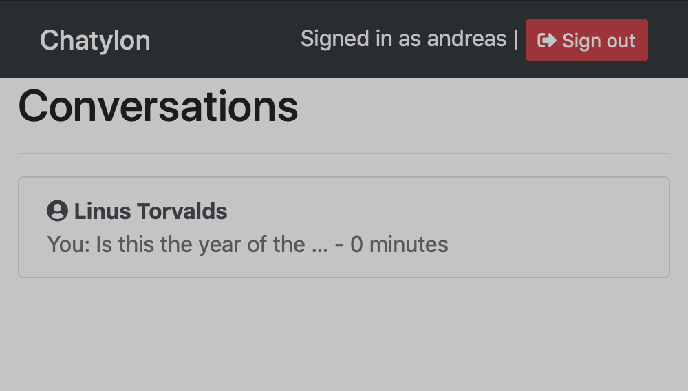

# Chatylon

Simple server-rendered chat app.

## Dependencies
- Django
- django-crispy-forms
- django-debug-toolbar
- django-model-utils
- python-decouple

## Instructions

1. Create and enter the venv:
> python3 -m venv venv && source venv/bin/activate

2. Install dependencies:
> pip install -r requirements.txt

3. Rename default .env
> mv .default_env .env

4. Run Django migrations:
> python manage.py migrate

5. Launch development server
> python manage.py runserver 8000